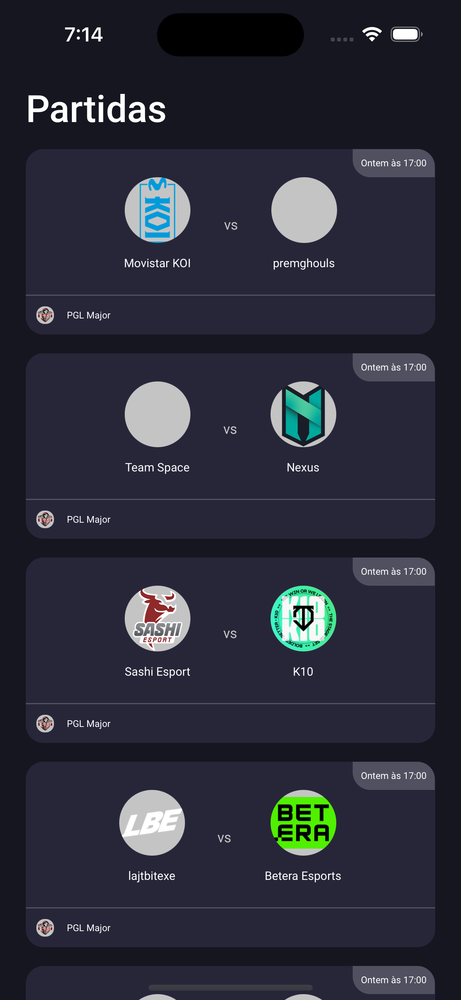
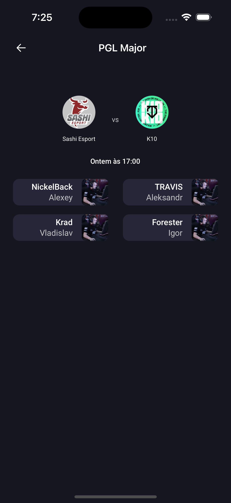

## About

App showcase.


##


## 🏗 How to start the project?

- You must have expo on your computer and the execute yarn ios / yarn android

- Put your key inside .env EXPO_PUBLIC_KEY

## 🚨 Tests

- To execute the tests:
```yarn test```

## 🕵🏻‍♂️ How to debug?

- You can use reactotron.
